# AstroZ

Satu chat untuk mengerjakan tugas koding, dengan tim pekerja di belakangnya.

Kamu menulis seperti mengobrol biasa. AstroZ meneruskan pesan itu ke sebuah tim:
satu perencana menyusun langkah, empat CLI pekerja (Claude Code, Codex, OpenCode,
OMP) mengerjakannya lewat 9Router sebagai gerbang model tunggal, lalu satu
penilai memeriksa hasilnya sebelum jawaban dikirim balik ke chat.

Jawabanmu muncul sebagai balasan chat. Proses kerjanya tidak dicampur ke dalam
percakapan: rencana, keluaran tiap pekerja, hasil tes, dan penilaian duduk di
panel terpisah di sebelahnya.

## Jalankan

```bash
/root/AstroZ/run.sh            # 9Router + penyaring SSE + UI di :8799
/root/AstroZ/run.sh 8799 --foreground
```

`run.sh` mencetak dua alamat: satu untuk dibuka dari HP (`http://<ip-lan>:8799/`),
satu untuk dari mesin sendiri.

Supaya tidak mati sendiri:

```bash
cd /root/AstroZ && /usr/local/lib/hermes-agent/venv/bin/python watchdog.py --loop --interval 30
```

Watchdog memeriksa port dengan koneksi TCP sungguhan, bukan `ss` (di container
proot ini `ss` tidak melaporkan socket yang listening, jadi pemeriksaan berbasis
`ss` akan menganggap semua layanan mati).

## Tiga bagian layar

| Bagian | Isi |
|---|---|
| Chat | pesanmu dan jawaban AstroZ, satu balon per pesan. Selalu menempel ke pesan terbaru, jadi jawaban tidak pernah perlu dicari dengan menggulir |
| Proses | satu baris per pekerjaan; ketuk untuk melihat rencana, keluaran tiap pekerja, hasil tes, dan penilaian. Di layar lebar panel ini jadi kolom tetap di kanan, di HP jadi panel geser |
| Alat | model dan pekerja, berkas proyek, git, tes, dan catatan kejadian |

Di layar lebar ketiganya tampil bersamaan: daftar percakapan di kiri, chat di
tengah, alat di kanan. Di HP chat memakai seluruh layar dan dua panel lain
terbuka sebagai geseran, supaya percakapan tidak pernah terpotong.

## Satu model untuk lima tempat

Tab Alat, bagian Model: pilih satu baris, tekan Terapkan. Sekali tekan, model
yang sama ditulis ke Hermes dan keempat pekerja.

| Sasaran | Berkas | Alamat yang ditulis |
|---|---|---|
| claude | `~/.claude/settings.json` | :20128 langsung |
| codex | `~/.codex/config.toml` | :20129 |
| opencode | `~/.config/opencode/opencode.json` | :20129 |
| omp | `~/.omp/agent/models.yml` | :20129 |
| hermes | `$HERMES_HOME/config.yaml` | :20128 langsung |

Port dan model itu dua hal terpisah: port adalah pintu yang diketuk, model adalah
siapa yang diminta di dalam pintu itu.

Daftar model dibaca dari dua sumber sekaligus, karena masing-masing tidak lengkap
sendiri:

- `/api/models` pada 9Router: katalog lengkap dengan nama, batas konteks, dan harga.
  Isinya hanya provider yang kredensialnya dikenal dashboard.
- `/v1/models`: daftar id yang benar-benar bisa dipanggil. Di sinilah provider
  seperti `kenari-id`, `dvvai`, `cavoti-ai`, dan `kr` muncul.

Id provider yang berupa uuid (`openai-compatible-chat-...`) diganti dengan prefix
yang dikenali (`kenari-id`, `oc-prod`, dan seterusnya), diambil dari daftar
koneksi 9Router. Tombol Tes mana yang hidup memeriksa model sungguhan dan
menandai mana yang menjawab.

## Alur kerja

- **Cepat**: satu pekerja langsung, lalu tes.
- **Sedang**: rencana singkat, satu sampai dua pekerja, tes, penilaian.
- **Besar**: tugas dipecah, dikerjakan paralel, pekerja saling menilai, tes,
  lalu penilaian akhir.

Kalau satu pekerja macet, tugas tidak ikut macet. Dua pengaman menjaganya:

- **Batas macet**: pekerja yang tidak menghasilkan kemajuan berarti selama
  `workflow.stall_seconds` (bawaan 240 detik) dihentikan. Baris progres seperti
  "Working..." tidak dihitung sebagai kemajuan, dan worker yang benar-benar
  mengalir keluarannya tidak pernah dipotong.
- **Eskalasi**: kalau semua percobaan gagal, tugas dicoba ke pekerja lain di
  daftar prioritas, sampai `workflow.escalate_tries` pekerja (bawaan 2). CLI
  yang macet gagal di model apa pun, jadi pindah pekerja lebih berguna daripada
  mengulang model.

Dua putaran perbaikan, keduanya bukan status akhir:

- tes merah, keluaran tes dikirim ke pekerja lain untuk diperbaiki (`fix_rounds`);
- penilaian menemukan masalah, daftar masalahnya dikirim balik ke pekerja lain
  (`fix_review_rounds`). Ini perlu karena tes hijau tidak berarti permintaan
  terpenuhi: pernah terjadi pekerja menambah newline padahal diminta tidak, dan
  tes buatannya sendiri tetap hijau.

Kalau model gateway tidak bisa dihubungi, rencana diisi versi sederhana supaya
tugas tetap jalan.

Pemilihan pekerja hemat dulu: `worker_order` dan `worker_cost` di `team.yaml`
menentukan urutannya, dan putaran perbaikan memakai pekerja termurah yang belum
menyentuh tugas itu.

## Berkas

```
config.py         pembaca team.yaml, token 9Router, kunci dari sqlite
hub.py            pusat kejadian (JSONL + SSE + pembaca berkas plugin)
gateway.py        klien 9Router: sinkron model, terapkan, chat, uji, setelan Hermes
adapters.py       empat adapter pekerja + apply_all
orchestrator.py   rencana, pekerja, diskusi, tes, penilaian, jawaban akhir
sessions.py       percakapan: satu utas berisi daftar tugas
project.py        daftar berkas, baca berkas, git, deteksi dan jalan tes
proxy.py          penyaring SSE :20129 ke 9Router :20128 (buang [DONE] ganda)
server.py         FastAPI: UI, API, SSE
watchdog.py       menjaga 9Router, penyaring, dan UI tetap hidup
web/index.html    kerangka UI
web/app.css       tampilan
web/app.js        perilaku: chat, panel proses, alat
assets/           banner README
tests/smoke.sh    uji end to end
```

`team.yaml` berisi kunci API dan tidak ikut ke repo; contohnya ada di
`team.yaml.example`.

## API

```
GET    /api/state                    ringkasan gateway, pekerja, tugas, proyek
GET    /api/sessions                 daftar percakapan
POST   /api/sessions                 percakapan baru
GET    /api/sessions/{id}            isi percakapan + kejadian tiap tugas
POST   /api/sessions/{id}            ganti judul
DELETE /api/sessions/{id}            hapus percakapan
POST   /api/chat                     kirim pesan: {text, session, workflow}
GET    /api/events?replay=N          aliran kejadian (SSE)
GET    /api/events/recent?limit=&kind=
POST   /api/gateway/sync?apply=0|1   baca model dari 9Router
GET    /api/gateway/models?q=&provider=&only_healthy=1
POST   /api/gateway/model            {model, apply_workers}
POST   /api/gateway/probe            uji model mana yang menjawab
POST   /api/gateway/key              {api_key}
POST   /api/apply                    tulis model sekarang ke semua pekerja
GET    /api/workers                  status pekerja
POST   /api/workers/{key}            aktifkan atau setel model pekerja
POST   /api/workers/{key}/probe      periksa satu pekerja
POST   /api/tasks                    kirim tugas langsung tanpa chat
GET    /api/tasks, /api/tasks/{id}   daftar dan rincian tugas
GET    /api/project/tree, /api/project/file?path=
GET    /api/git, /api/git/diff       POST /api/git/commit
POST   /api/test                     jalankan tes
POST   /api/config                   ubah folder kerja atau setelan alur
```

## Catatan teknis

Beberapa hal yang perlu diketahui sebelum mengubah isi repo ini:

- 9Router menutup stream SSE dengan `data: [DONE]` dua kali. Parser ketat
  (opencode) mati karenanya, jadi ada `proxy.py` di :20129 yang membuang
  terminator kedua. Semua pekerja menembak :20129; Hermes tetap ke :20128
  langsung karena Hermes tahan terhadap `[DONE]` ganda dan Hermes adalah alat
  untuk memperbaiki susunan ini.
- opencode menentukan folder kerjanya dari `process.env.PWD`, bukan `cwd` proses.
  Karena itu `env["PWD"]` diset sama dengan folder kerja; tanpa itu berkas
  mendarat satu tingkat di atas proyek dan tugas tetap melaporkan sukses.
- OMP perlu `--auto-approve` (kalau tidak, tugas menggantung di prompt pertama)
  dan provider [OI]-compatible harus didaftarkan di `~/.omp/agent/models.yml`.
- Codex CLI 0.154 ke atas memakai `wire_api = "responses"`, bukan `"chat"`.
- Claude menambahkan suffix `[1m]` pada model dari settings.json, jadi model
  selalu dikirim lewat `--model` eksplisit.
- Penilaian otomatis dari 9Router tidak semua hidup. Pakai Tes mana yang hidup.
- Sebagian provider bisa mati sewaktu-waktu: `oc-prod/*` pernah menjawab 404
  "No active credentials for provider" untuk semua modelnya, dan `cavoti-ai`
  menjawab 503. Model yang sedang dipakai harus yang benar-benar menjawab, kalau
  tidak semua pekerja akan menunggu jawaban yang tidak pernah datang. Cek dengan
  Tes mana yang hidup, lalu pilih model yang lolos.
- Model penalaran kadang mengisi `reasoning` dan membiarkan `content` kosong.
  `gateway.chat` menerima keduanya, dan penilai yang hanya mengembalikan template
  "PASS|FAIL" dicatat sebagai UNKNOWN, bukan ditebak.
- Jawaban yang kamu baca di chat bukan keluaran mentah pekerja. Keluarannya berisi
  baris progres, jejak berkas, dan kode warna terminal; semuanya dibersihkan dulu,
  lalu model gateway merangkumnya jadi beberapa kalimat yang bisa dibaca. Kalau
  gateway tidak bisa dihubungi, dipakai baris paling informatif dari pekerja.
- Setiap tugas yang selesai disimpan sebagai commit di folder kerja hanya kalau
  tes dan penilaiannya lulus (`workflow.auto_commit`).
- Jawaban yang dikirim balik ke chat adalah ringkasan dari model gateway, bukan
  keluaran mentah pekerja. Kalau tidak ada pekerja yang berhasil, jawabannya
  mengatakan itu apa adanya, bukan mengarang hasil.

## Plugin Hermes

`~/.hermes/plugins/astroz` menambahkan tool `coding_team` (submit, status, tasks,
models, model, sync, test), mencerminkan aktivitas agent loop ke aliran kejadian
UI, dan menyediakan perintah `/team`, `/team-model`, `/team-tasks`, `/team-sync`,
`/team-apply`.

```bash
hermes plugins enable astroz
```

## Uji

```bash
/root/AstroZ/tests/smoke.sh
MODEL=oc-prod/gemini-3.7-flash /root/AstroZ/tests/smoke.sh
```

## Catatan tampilan

Tema gelap dipilih karena ini alat kerja yang dipakai malam hari dari HP, sering
dengan satu tangan. Paletnya dua warna inti ditambah satu aksen hijau untuk aksi
utama dan status hidup.

Angka kontras dihitung, bukan dikira-kira, dan diuji dengan rumus WCAG:

| Pasangan | Rasio |
|---|---|
| teks utama `#F8FAFC` pada permukaan `#1B2336` | 14.98:1 |
| teks sekunder `#A6B4C8` pada `#1B2336` | 7.45:1 |
| aksen `#22C55E` pada `#1B2336` | 6.88:1 |
| teks di atas aksen `#0F172A` pada `#22C55E` | 7.83:1 |
| tepi komponen `#6B7C99` pada permukaan `#232D42` | 3.26:1 (ambang elemen non-teks) |

Ikon diambil dari teks, bukan dari pustaka ikon. Animasi hanya dipakai untuk
menandai hal yang sedang berjalan (penanda kerja dan titik yang berjalan di
banner), dan semuanya berhenti saat pekerjaan selesai. Ukuran target sentuh
minimal 44px, navigasi utama 56px. Tampilan diuji pada lebar 375px, 768px, dan
1280px, termasuk pemeriksaan fokus keyboard dan tidak adanya geseran mendatar.
